<div align="center">

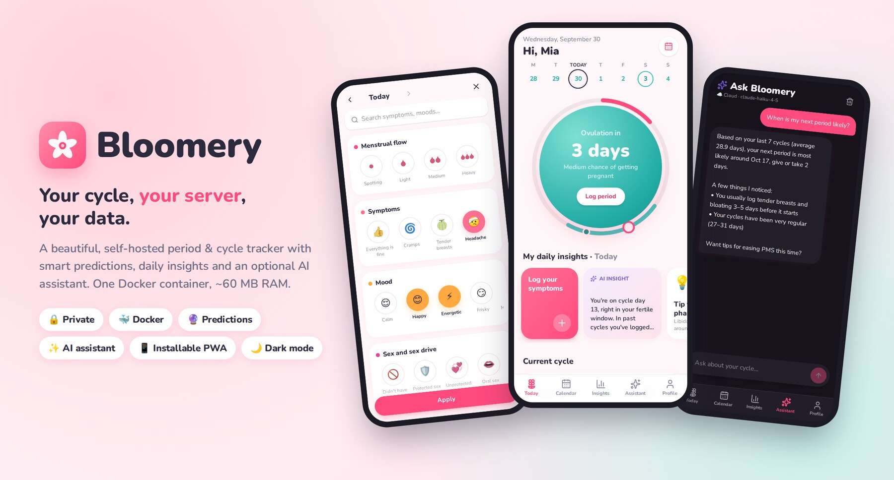

# 🌸 Bloomery

**A beautiful, private, self-hosted period & cycle tracker — with smart predictions, daily insights and an optional AI assistant.**

[](https://github.com/krugerhomeassistant/Bloomery/releases)
[](https://github.com/krugerhomeassistant/Bloomery/actions/workflows/ci.yml)
[](docs/home-assistant.md)
[-E5E4E2?logo=homeassistant&logoColor=white)](custom_components/bloomery/quality_scale.yaml)
[](https://github.com/krugerhomeassistant/Bloomery/pkgs/container/bloomery)


[](LICENSE)

[Features](#-features) · [Screenshots](#-screenshots) · [Install](#-install-in-60-seconds) · [ZimaOS](#-zimaos--casaos) · [AI](#-ai-assistant) · [Home Assistant](#-home-assistant--calendar) · [Privacy](#-privacy) · [How it works](#-how-predictions-work) · [Roadmap](#-roadmap)

</div>

---

Period apps know some of the most personal data about you, and most of them live on someone else's servers. **Bloomery** gives you the polished experience of a modern cycle tracker, but it runs on **your** hardware: a NAS, a Raspberry Pi, a home server or a $5 VPS. One container, one SQLite file, no telemetry, no ads, no accounts anywhere but your own.

## ✨ Features

<table>
<tr>
<td width="50%" valign="top">

### 🌷 Today at a glance
A big, colour-coded **cycle ring** that tells you what matters right now: *Period · Day 2*, *Ovulation in 3 days*, *Period in 12 days* or *Late by 2 days*, with your chance of pregnancy and a week strip on top.

### 📅 Calendar
Logged periods, **predicted periods**, fertile window and ovulation day across 13 months. Tap **Edit period** to tick days on and off.

### 📝 One-tap logging
Flow plus **10 categories** of chips: symptoms, mood, sex & libido, discharge, digestion, activity, pill, ovulation and pregnancy tests. Also basal temperature, weight, water, sleep and notes, all searchable.

</td>
<td width="50%" valign="top">

### 🔮 Predictions that learn
Recency-weighted cycle length, learned period length, **BBT thermal-shift ovulation detection** and a learned luteal phase. Late cycles push predictions forward automatically.

### 💡 Daily feed
- **Heads-ups** from *your own* history: *"You might notice tender breasts today (4 of your last 5 cycles)"*
- Milestones: period started, fertile window opens, period due, late
- **Last-cycle recap** and rotating phase tips
- A helpful note every time you log

### 🔔 Notifications
A daily message on your phone with milestones, heads-ups, recaps, tips or a **pill reminder**, via **ntfy, Gotify, Home Assistant or Discord**. Works on plain-HTTP home servers; no app store needed.

### 💞 Partner sharing
A private read-only link for your partner showing where you are in your cycle, the next 5 weeks and tips on how to support you. Symptoms, moods, sex and notes are never shared, and one tap revokes the link.

### 🤰 Life stages
Switch to **Pregnancy** mode for your week, due date, baby-size cards and trimester tips, or **Perimenopause** mode for wider prediction ranges, days since your last period and the 12-month menopause marker. Your history stays intact.

### 🔐 App lock
Optional 4-digit PIN when you come back after being away (1 minute to 4 hours, your choice per device; 15 minutes by default).

### 🏠 Home Assistant & calendar
A **Home Assistant integration** built to HA's Platinum quality rules (HACS, UI setup, no YAML): cycle sensors plus colour-coded **Periods / Fertile windows / Ovulation calendars**, and a private **iCalendar feed** for Google, Apple or Outlook.

### 📊 Insights
Averages, regularity, cycle history, **symptom ↔ phase patterns**, temperature and weight charts, plus gentle health-check flags.

</td>
</tr>
<tr>
<td valign="top">

### ✨ AI assistant *(optional)*
A daily personalised insight, a **written recap of every cycle** (tap any cycle in Insights), plus a chat that already knows your cycle history. Connect **Claude, OpenAI, OpenRouter, Ollama** or any OpenAI-compatible server, **right from the app**.

</td>
<td valign="top">

### 🏠 Built for self-hosting
Multi-arch Docker image · ~60 MB RAM · installable **PWA** · dark mode · multi-user · argon2 passwords · **import your history from Flo, Clue, Apple Health or CSV** · JSON export · one-tap account deletion.

</td>
</tr>
</table>

## 📸 Screenshots

<div align="center">

| Today | Daily feed | Log your day | After logging |
|:---:|:---:|:---:|:---:|
| 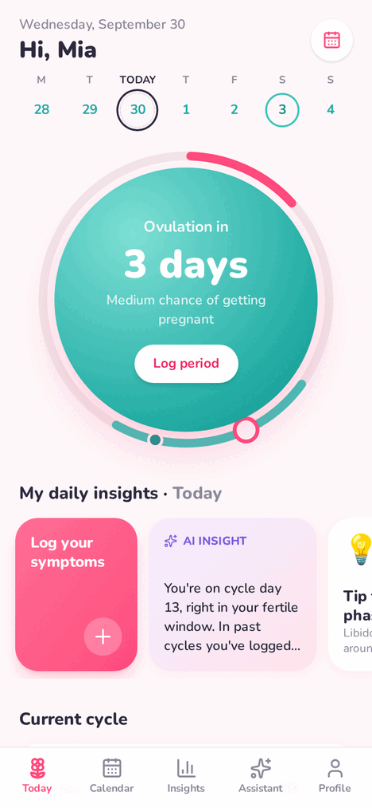 | 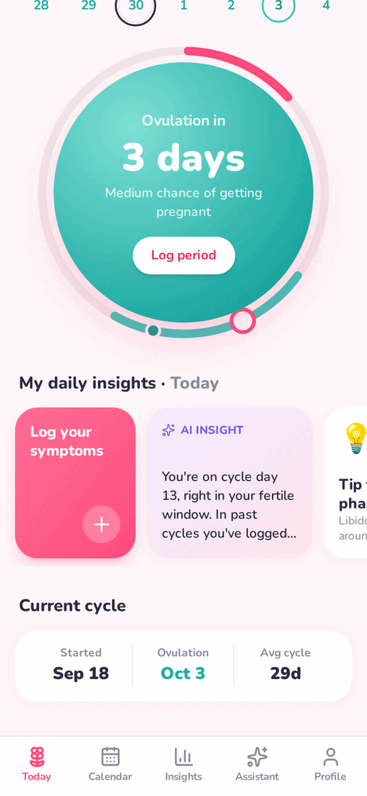 | 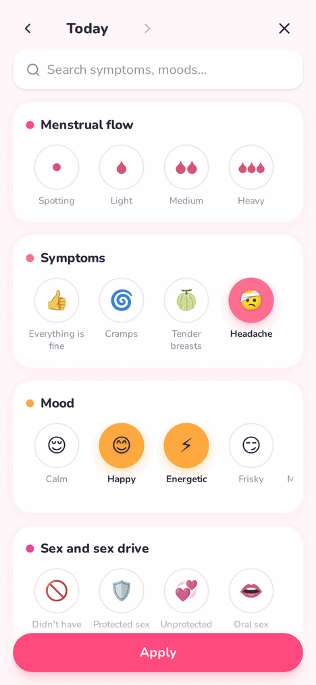 | 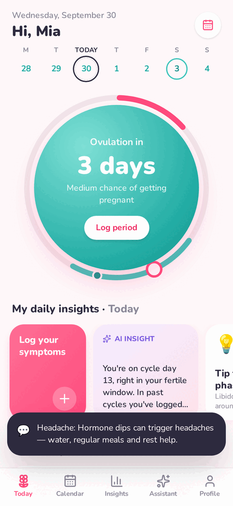 |
| **Calendar** | **Insights** | **Body patterns** | **AI assistant** |
| 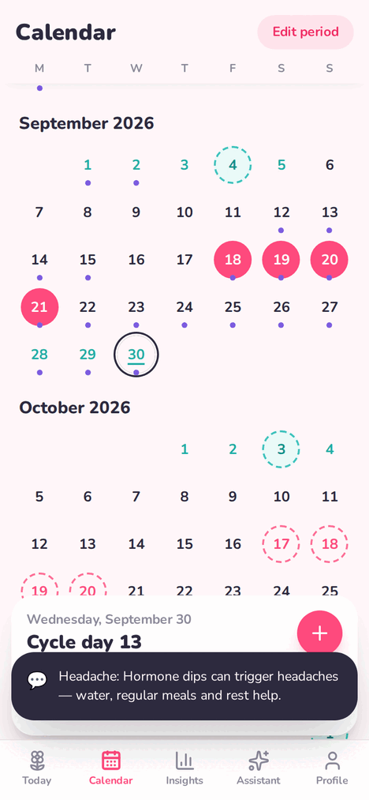 | 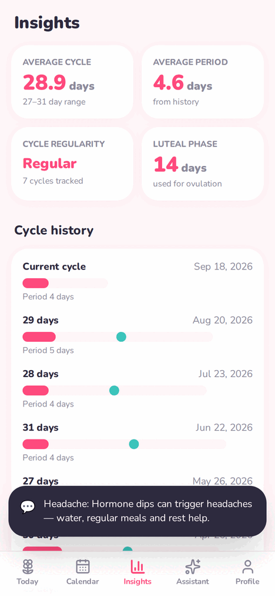 | 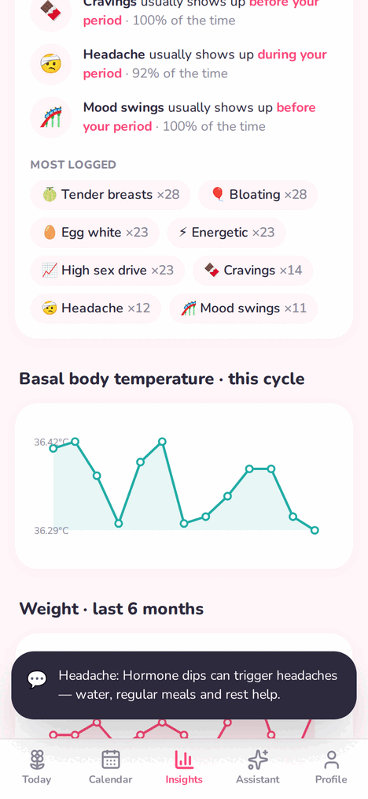 | 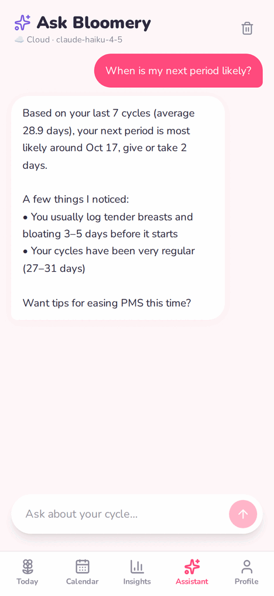 |

<details>
<summary><b>🌙 Dark mode</b></summary>
<br>

| Today | Calendar | Insights | AI setup |
|:---:|:---:|:---:|:---:|
| 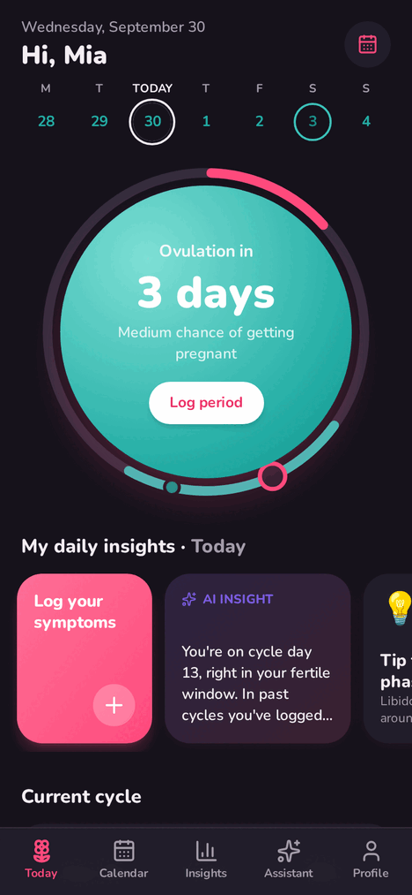 | 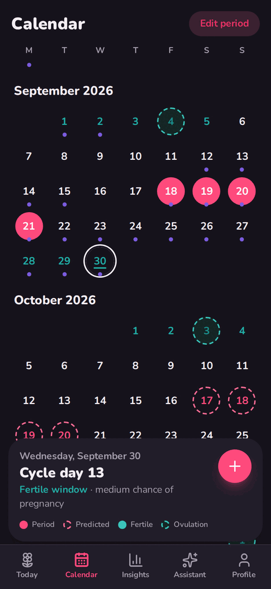 | 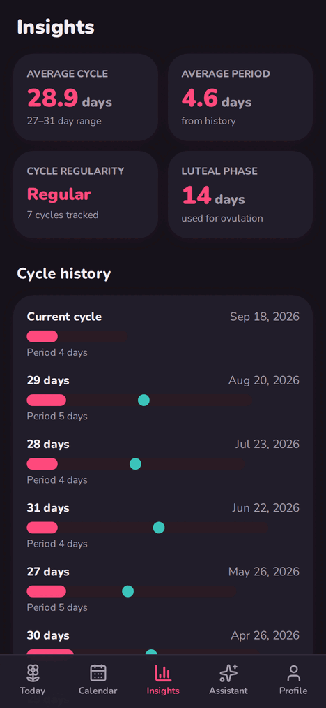 | 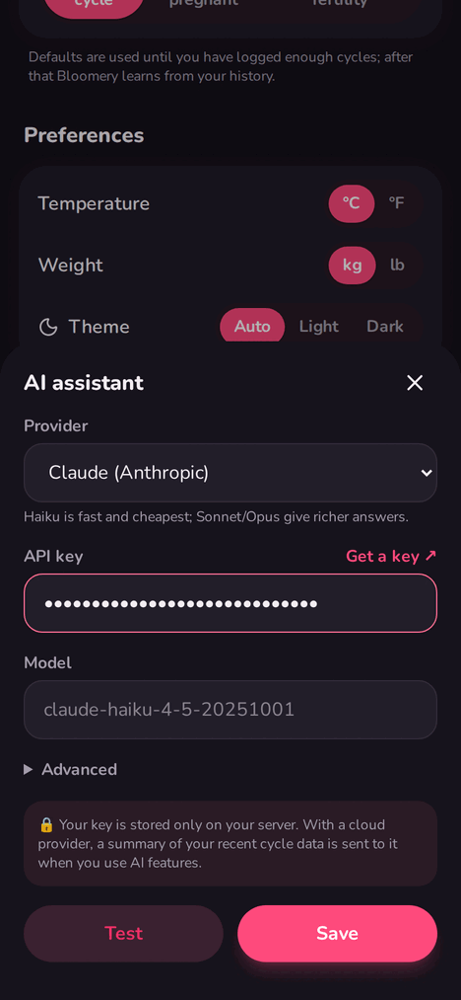 |

</details>
</div>

## 🚀 Install in 60 seconds

**Docker (one line):**

```bash
docker run -d --name bloomery -p 8420:8000 -v bloomery-data:/data --restart unless-stopped \
  ghcr.io/krugerhomeassistant/bloomery:latest
```

**Or Docker Compose:**

```bash
git clone https://github.com/krugerhomeassistant/Bloomery.git && cd Bloomery
docker compose up -d            # pulls the prebuilt image (use --build to build from source)
```

Open **http://your-server:8420**. The first account you create becomes the owner, and sign-ups close automatically after that.

📱 **On your phone:** open the URL, then use your browser menu → **Add to Home Screen**. It launches full-screen, like a native app.

## 🧊 ZimaOS / CasaOS

1. Dashboard → **App Store** → **+** → **Install a customized app** → **Import**
2. Paste [`docker-compose.zimaos.yml`](docker-compose.zimaos.yml) → **Install**
3. Open `http://<zima-ip>:8420`

Data lives in `/DATA/AppData/bloomery`. The app is capped at 256 MB RAM (it uses ~60 MB), so it happily runs next to everything else on small boxes.

## 🤖 AI assistant

Everything works without AI. Turning it on adds a **personalised daily insight** and a **chat** that answers questions like *"why am I so tired before my period?"* using your own logs.

Set it up in the app: **Profile → AI assistant → pick a provider → paste key → Test → Save.**

| Provider | Default model | Notes |
|---|---|---|
| **Claude (Anthropic)** | `claude-haiku-4-5` | Fast and inexpensive; Sonnet/Opus for richer answers |
| **OpenAI** | `gpt-5-mini` | |
| **OpenRouter** | `openrouter/auto` | One key, hundreds of models |
| **Ollama** | `llama3.2:3b` | 100% local. Needs ~3–4 GB free RAM (`docker compose --profile ai up -d`) |
| **Custom** | — | Any OpenAI-compatible server: LM Studio, vLLM, LiteLLM… |

Only the owner account can change AI settings. The API key is stored in your database and **never sent back to the browser**.

## 🔔 Notifications

**Profile → Daily reminders & heads-ups** → paste a URL → **Send test** → **Save**. You get at most one message a day at your chosen time, and nothing on quiet days.

| Service | URL to paste |
|---|---|
| **ntfy** (easiest) | `https://ntfy.sh/<hard-to-guess-topic>` or your own ntfy server |
| **Gotify** | `https://gotify.lan/message?token=<app-token>` |
| **Home Assistant** | `http://homeassistant.local:8123/api/webhook/<id>` (`trigger.json.title` / `.message`) |
| **Discord** | channel webhook URL |

## 🏠 Home Assistant & calendar

[](https://my.home-assistant.io/redirect/hacs_repository/?owner=krugerhomeassistant&repository=Bloomery&category=integration)

1. Add this repo to HACS as a custom **Integration** repository (button above), download **Bloomery**, restart HA.
2. In Bloomery: **Profile → Home Assistant & calendar → Create feed**, copy the integration URL.
3. In HA: **Settings → Devices & services → Add integration → Bloomery**, paste it.

You get a *Bloomery* device with **status, cycle day, phase, days until period, next period, ovulation, pregnancy chance, life stage** (and pregnancy week / due date) sensors, **period** and **fertile window** binary sensors, and **Periods**, **Fertile windows** and **Ovulation** calendars, each with its own colour. Read-only, refreshed every 15 minutes and at midnight.

📖 **[Full integration guide](docs/home-assistant.md)**: entities, automation examples, troubleshooting, removal.

**Other calendar apps:** subscribe to the `.ics` link shown in the same Profile section; add `&type=period`, `&type=fertile` or `&type=ovulation` to get one calendar per type with its own colour.

Feeds contain cycle dates only, never symptoms or notes. **New token** invalidates the old links (HA asks for the new one); **Turn off** removes them.

## 🔒 Privacy

- **Your data never leaves your server** unless you enable a cloud AI provider. Even then, only a compact summary of your recent cycle (no username, no password) is sent, and only when you use an AI feature.
- No analytics, no trackers, no external fonts or CDNs; everything is bundled.
- Passwords hashed with **argon2id**; signed, HTTP-only session cookies; **login brute-force throttling** (10 failures / 15 min per IP).
- Security headers on every response (no framing, no sniffing, no referrer); API responses are `no-store`, so health data never lands in shared caches.
- **Export** everything as JSON at any time, or **delete** your account and all data in one tap.

## 🧠 How predictions work

<details>
<summary>Open the maths</summary>

- **Periods** are runs of bleeding days (spotting never starts a period); gaps of up to 2 days are merged.
- **Next cycle length** is a recency-weighted average of your last 6 cycles (15–90 days), blended with your configured default until 3 cycles exist.
- **Ovulation** uses the *3-over-6* basal temperature rule when you log BBT; otherwise *next period − luteal length*. Your luteal length is learned from BBT-confirmed cycles.
- **Fertile window** is ovulation −5 to +1 days (sperm survival plus egg lifespan).
- **Heads-ups:** a symptom is forecast when you logged it within ±1 day of today's position (aligned to cycle start *or* to your next period) in ≥2 past cycles and ≥50% of them.
- **Health flags:** cycles outside 21–35 days, variation >9 days, periods >7 days, or 7+ days late.

</details>

> ⚠️ **Bloomery is not a medical device and not a method of contraception.** Predictions are estimates. Talk to a healthcare professional about anything that worries you.

## 🏗️ Architecture

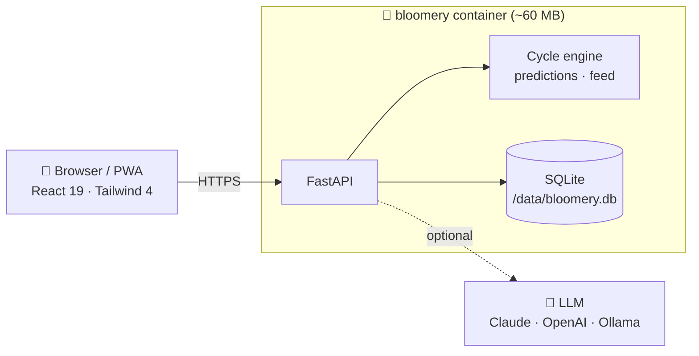

| Layer | Tech |
|---|---|
| Frontend | React 19, Vite 8, Tailwind CSS 4, React Router 7, PWA (Workbox) |
| Backend | Python 3.13, FastAPI, SQLModel/SQLite (WAL), httpx |
| Image | Multi-stage, non-root, healthcheck, `linux/amd64` + `linux/arm64` |

Deeper docs: [Architecture](docs/ARCHITECTURE.md) · [Wiki](docs/WIKI.md) · [Plan](docs/PLAN.md) · API reference at `/api/docs` on your instance.

## ⚙️ Configuration

All optional. Set in `.env` or the container environment ([full list](.env.example)).

| Variable | Default | Purpose |
|---|---|---|
| `BLOOMERY_PORT` | `8420` | Host port (compose) |
| `BLOOMERY_ALLOW_REGISTRATION` | `auto` | `auto` = open until the first account · `true` · `false` |
| `BLOOMERY_SECURE_COOKIES` | `false` | Set `true` behind HTTPS |
| `BLOOMERY_SECRET_KEY` | auto-generated | Session signing key (stored in `/data/secret.key`) |
| `BLOOMERY_AI_*` | — | Optional AI defaults; the in-app settings override them |

**Exposing it on a domain?** Put it behind a reverse proxy with HTTPS (Nginx Proxy Manager, Caddy, Traefik, Cloudflare Tunnel) and set `BLOOMERY_SECURE_COOKIES=true`. Only do that if you *always* use the HTTPS address, because browsers won't send secure cookies over plain `http://`.

**Moving from another app?** Profile → **Import data** accepts:
- **Apple Health**: *Health → your picture → Export All Health Data*, unzip it, and pick `export.xml`. Your phone reads the file itself and uploads only periods, cycle symptoms, basal temperature, cervical mucus and test results; the rest of your health data never leaves the device.
- **Flo** (*Settings → Request my data*), a **Clue** backup (`.cluedata`), or a **CSV** (a `date` column plus a `period`/`flow` column, or `start`/`end` columns). These import period history.

Days you've already logged are never overwritten; imported symptoms are added to them.

**Backups:** copy the `/data` volume (`bloomery.db` + `secret.key`), or use in-app **Export**.

## ⬆️ Updating & releases

Bloomery uses [semantic versioning](https://semver.org/); every release is listed in the [changelog](CHANGELOG.md) and on [GitHub Releases](https://github.com/krugerhomeassistant/Bloomery/releases).

- **App**: `docker compose pull && docker compose up -d` (or *Update* in ZimaOS). Pin `ghcr.io/krugerhomeassistant/bloomery:1.2` (patch updates only) or `:1.2.0` (exact) instead of `:latest` if you prefer.
- **Home Assistant**: HACS shows each release as an update.

## 🛠️ Development

```bash
# backend
cd backend && python -m venv .venv && .venv/bin/pip install -r requirements.txt pytest
.venv/bin/uvicorn app.main:app --reload          # http://localhost:8000
.venv/bin/python -m pytest -q

# frontend (proxies /api to :8000)
cd frontend && npm install && npm run dev         # http://localhost:5173

# demo data: user demo / demodemo
python scripts/seed_demo.py http://localhost:8000
```

Linting, Home Assistant tests and the release process are in [CONTRIBUTING.md](CONTRIBUTING.md). Security reports: [SECURITY.md](SECURITY.md).

## 🗺️ Roadmap

- [x] Predictions, calendar, logging, insights
- [x] AI assistant with in-app provider setup
- [x] Daily feed: heads-ups, milestones, recaps
- [x] Multi-arch image on GHCR
- [x] Notifications via ntfy / Gotify / Home Assistant / Discord
- [x] App lock (PIN)
- [x] Import from Flo, Clue, Apple Health and CSV
- [x] AI-written cycle recaps
- [x] Pregnancy and perimenopause modes
- [x] Partner sharing (read-only link)
- [x] Home Assistant integration (HACS) + calendar feed
- [x] Streaming AI replies
- [ ] Translations

Ideas and bug reports are welcome. [Open an issue](https://github.com/krugerhomeassistant/Bloomery/issues).

## 📄 License

[MIT](LICENSE): free to use, modify and share.

<div align="center">
<br>
<sub>Made with 🌸 for people who'd rather keep their cycle to themselves.</sub>
</div>
